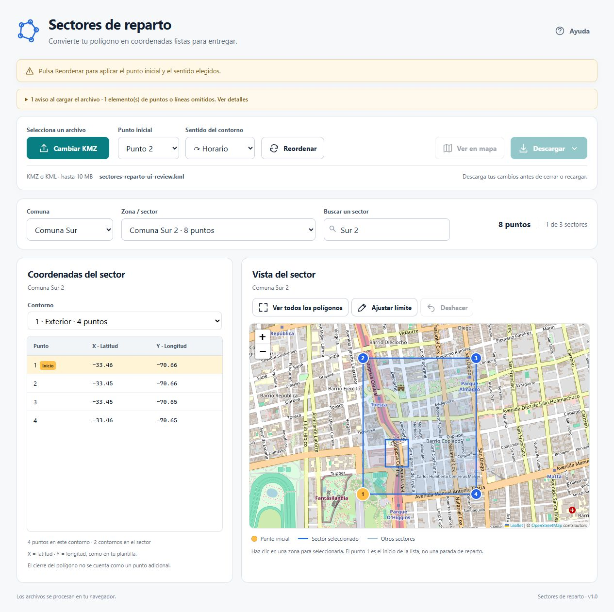

# Auditoría de diseño y experiencia de uso

Revisión del 2 de octubre de 2026. Objetivo: que el cliente encuentre las acciones, entienda los avisos y pueda revisar sus sectores sin información importante escondida al final de la página.

## Hallazgos y cambios aplicados

| Prioridad | Hallazgo | Cambio |
| --- | --- | --- |
| Alta | Los avisos de estado estaban después del mapa y de la tabla. En móvil, enfocar la búsqueda podía ocultarlos. | La barra aparece después del encabezado y permanece visible al desplazarse. Los errores de validación y el resumen de importación también están antes de los controles. |
| Alta | La búsqueda cambiaba el sector sin actualizar la comuna y podía quedar limitada a una comuna elegida previamente. | La búsqueda recorre todo el archivo y sincroniza la comuna del resultado seleccionado. Cambiar la comuna limpia la búsqueda; limpiar la búsqueda restaura todas las comunas. |
| Alta | Se cargaban los contornos válidos en sentido antihorario, aunque el selector inicialmente decía Horario. El mensaje al reordenar también invertía los nombres de los sentidos. | La carga ordena los contornos válidos en sentido horario conservando la identidad del primer punto. El mensaje indica el sentido realmente aplicado. Los polígonos inválidos conservan sus puntos hasta corregirlos; GeoJSON mantiene su orientación reglamentaria. |
| Media | El botón de subida estaba desalineado por la ayuda colocada debajo. | Se añadió «Selecciona un archivo» encima. Botón, selectores y acciones comparten una altura de 46 px. La ayuda de formato quedó en una línea común dentro de la barra. |
| Media | Una fila repetía el nombre, «Archivo cargado» y otra acción de cambiar archivo. | Se eliminó la fila. El nombre permanece en un espacio compacto y el botón de subida permite cambiar el archivo. Los nombres largos se truncan con el nombre completo disponible en su título. |
| Media | Sin coincidencias se mostraba el estado inicial de subida, pese a existir un archivo. | Se añadieron mensajes específicos en tabla y mapa, más «Limpiar búsqueda y filtros». Se deshabilitan las acciones que necesitan un sector. |
| Media | Un aviso de error podía repetirse en la barra y en otro bloque. Los detalles de importación podían ocupar demasiado espacio. | Se evita repetir el mismo error. Los detalles de importación se despliegan a petición y su lista tiene altura limitada y desplazamiento propio. |
| Baja | El icono del botón de ejemplo heredaba el tamaño del icono decorativo. Las acciones del mapa comprimían el título. | La regla de tamaño solo afecta al icono decorativo. Las acciones del mapa están en su propia fila y se adaptan al ancho disponible. |
| Baja | El recordatorio de conservar los cambios estaba en el último aviso y el pie incluía una firma personal. | El recordatorio está junto a las acciones. El pie indica que los archivos se procesan en el navegador. |
| Media | Los límites de los otros sectores tenían poco contraste sobre las calles y podían perderse al mirar el mapa. | Se cambió el trazo a gris pizarra oscuro, opaco y de 2,2 px, con un halo blanco de 4,5 px. El sector seleccionado conserva el azul con un trazo de 3,3 px. La leyenda refleja el nuevo color. |

## Criterios usados

- **Visibilidad y recuperación:** el aviso muestra qué ocurrió y qué hacer; la búsqueda sin resultados ofrece una acción de recuperación.
- **Consistencia:** selección, comuna, tabla y mapa representan el mismo sector; selector y mensaje usan el mismo sentido.
- **Jerarquía:** acciones y avisos se presentan antes de los resultados; los detalles extensos se consultan cuando hacen falta.
- **Accesibilidad:** se conserva `role="status"`, se anuncia el mensaje completo con `aria-atomic`, los errores usan un anuncio inmediato y los avisos normales un anuncio discreto. El foco por teclado se destaca también en los resúmenes desplegables. Referencia: [W3C, mensajes de estado](https://www.w3.org/WAI/WCAG22/Understanding/status-messages.html).
- **Adaptación:** los controles se distribuyen en filas o columnas según el espacio y las tablas tienen desplazamiento propio. Referencia: [W3C, redistribución del contenido](https://www.w3.org/WAI/WCAG22/Understanding/reflow.html).

## Verificación

- `npm test`: 15 pruebas aprobadas; 1 prueba opcional del KMZ real omitida porque no está en `datos-locales/RM.kmz`.
- `npm run build`: compilación correcta.
- Interfaz comprobada en escritorio y con anchos de 390 y 320 px: sin desbordamiento horizontal de la página; barra de estado visible a 12 px del borde superior después de desplazarse.
- Alineación medida: los seis controles principales de la barra tienen la misma posición vertical y altura de 46 px en escritorio.
- Archivo sintético con dos comunas, un polígono con contorno interior, un polígono cruzado y un punto omitido: búsqueda entre comunas, retorno a todas las comunas al limpiar, ausencia de resultados y recuperación comprobados.
- Sentido horario comprobado en las coordenadas del exterior y del interior. Mensajes de reordenamiento comprobados en ambos sentidos.
- Entrada y cancelación de edición comprobadas; filtros y subida permanecen bloqueados durante el ajuste.
- Descarga de un conjunto con un sector inválido bloqueada con identificación del sector. Para un sector válido, la interfaz confirmó la preparación del CSV y no registró errores de consola. El navegador integrado no entregó un evento de descarga ni una ruta para abrir ese archivo; los contenidos CSV, Excel y GeoJSON están cubiertos por las pruebas del proyecto.

Esta revisión no es una certificación completa de WCAG. No incluye pruebas con lectores de pantalla, dispositivos físicos ni una sesión de usabilidad con clientes.

